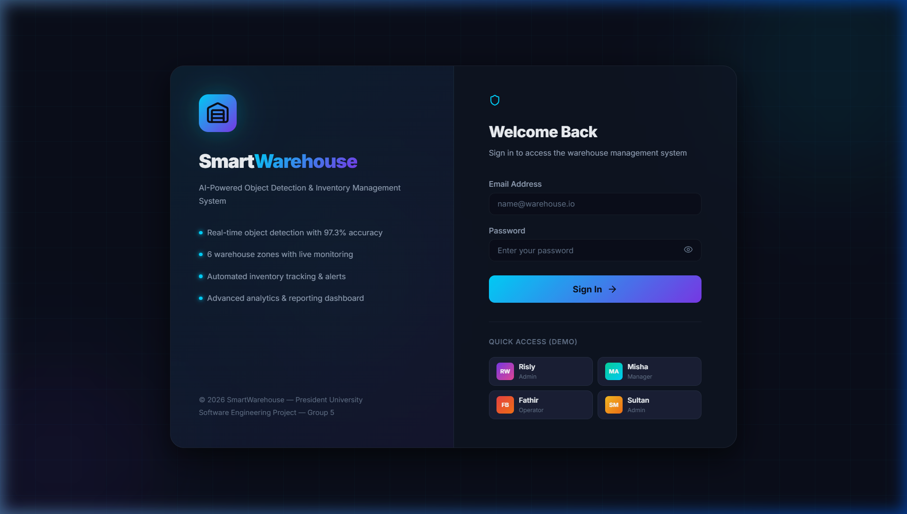
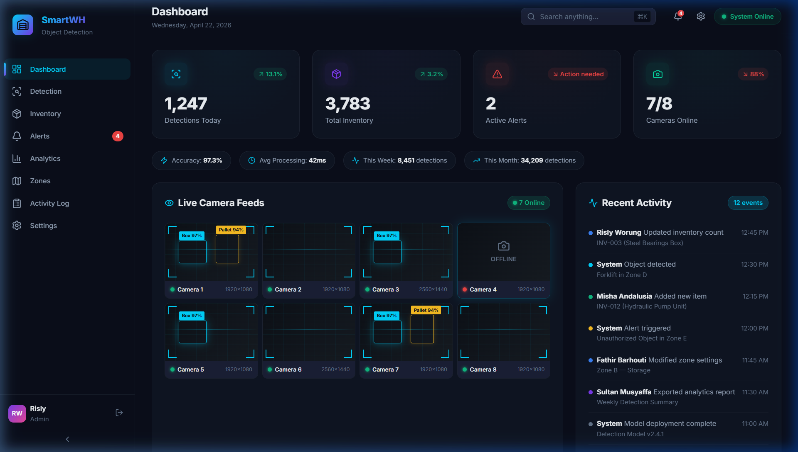
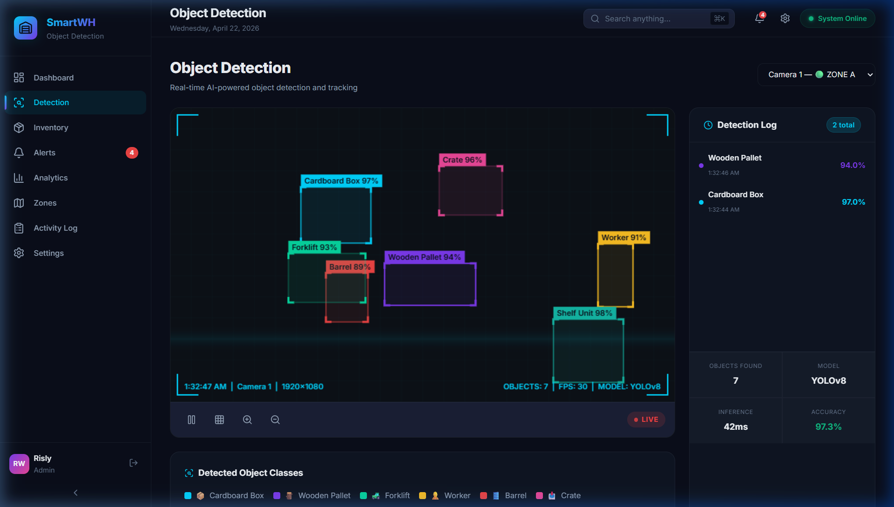
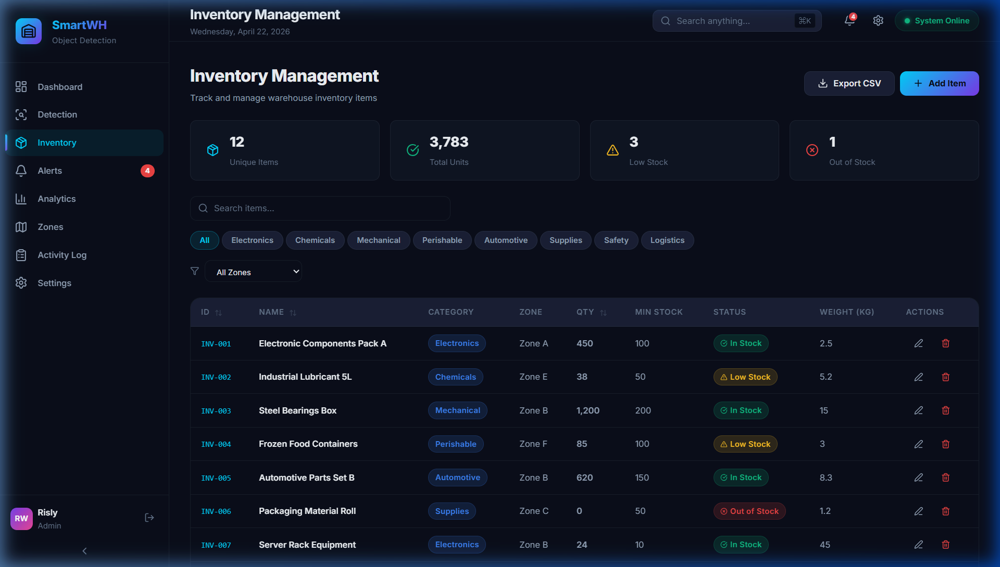
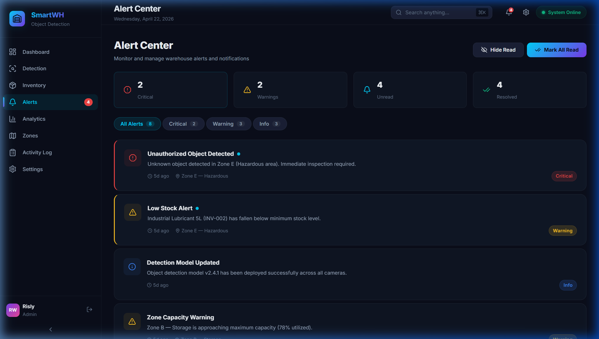
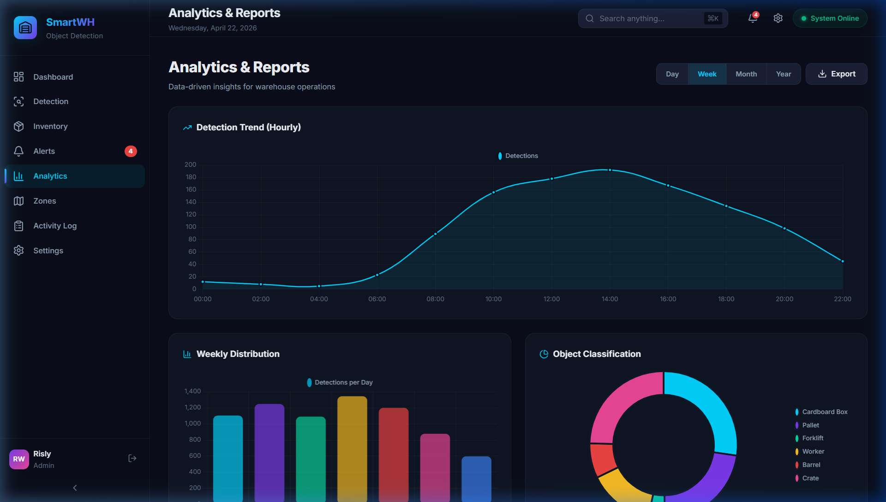
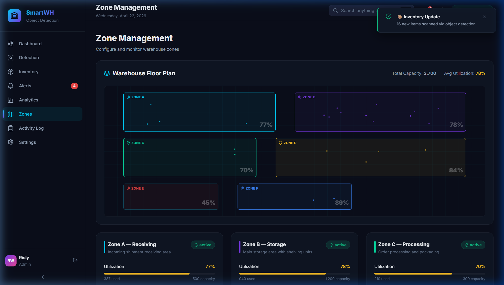
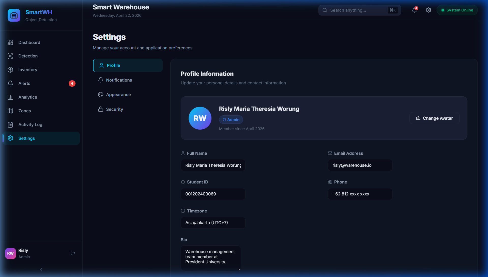

Smart Warehouse -- Bio-Hazard & Pest Detection System

<div align="center">

**AI-Powered Object Detection & Inventory Management for Modern Warehouses**


</div>

---

## Table of Contents
- [About the Project](#about-the-project)
- [Features](#features)
- [Tech Stack](#tech-stack)
- [Team Members and Roles](#team-members-and-roles)
- [Product Backlogs](#product-backlogs)
- [Sprint Documentation](#sprint-documentation)
- [Getting Started](#getting-started)
- [Project Structure](#project-structure)
- [Scrum Methodology](#scrum-methodology)

---

## About the Project

Smart Warehouse is a web based system designed to detect bio-hazard and pest presence in warehouse environments using simulated object detection. The system focuses on improving safety by identifying potentially harmful animals and preventing contamination.

In addition to detection, the system also includes warehouse monitoring features such as inventory tracking, zone management, and analytics to support operational efficiency.

This project was developed as part of a Software Engineering course at President University using the Scrum methodology.

## Bio-Hazard Detection Context

This project focuses on detecting animals such as snakes, cats, and geckos that may pose risks in warehouse environments. The system aims to improve safety and prevent contamination through early detection and alert mechanisms.

## Detection Workflow

1. Camera captures real-time footage (simulated)  
2. System processes the image  
3. Object detection identifies potential pests (snake, cat, gecko)  
4. System classifies the risk level  
5. Alert is triggered for warehouse staff  
6. Data is stored for monitoring and analysis  

### What This Project Does

- Simulates real-time detection of harmful animals using bounding boxes  
- Helps identify potential bio-hazards in warehouse environments  
- Allows users to manage inventory items with search and filtering  
- Monitors 6 warehouse zones with a visual floor plan  
- Sends alerts when potential hazards are detected  
- Provides analytics charts for decision making  

---

## Screenshots

### Login Page


### Dashboard


### Object Detection


### Inventory Management


### Alert Center


### Analytics and Reports


### Zone Management


### Settings


---

## Features

| Feature | Description |
|---------|-------------|
| **Authentication** | Role-based login system (Admin, Manager, Operator) with route protection |
| **Dashboard** | Overview page with KPI cards, camera feeds, activity feed, and system health |
| **Object Detection** | Canvas-based simulation with animated bounding boxes and a detection log |
| **Inventory** | Full CRUD operations, search, category/zone filters, sortable table, CSV export |
| **Alert Center** | Severity-based filtering (critical/warning/info), read/unread state |
| **Analytics** | 5 chart types using Chart.js -- line, bar, doughnut, etc. |
| **Zone Management** | Interactive floor plan with utilization tracking per zone |
| **Activity Log** | Audit trail with type-based filters and timeline view, exportable to CSV |
| **Settings** | Profile editing, notification preferences, theme customization, security settings |
| **Dark UI Theme** | Custom dark theme with glassmorphism effects and neon accents |

---

## Tech Stack

| Layer | Technology | Purpose |
|-------|-----------|---------| 
| **Build Tool** | Vite 8.x | Development server and bundling |
| **Frontend** | React 19 | Component-based UI |
| **Styling** | Vanilla CSS | Custom design system with CSS variables |
| **Charts** | Chart.js + react-chartjs-2 | Data visualization |
| **Icons** | Lucide React | Icon system |
| **Routing** | React Router v6 | Client-side routing with auth guards |
| **State** | Context API + useReducer | Global state management |
| **Canvas** | HTML5 Canvas API | Object detection simulation |

---

## Team Members and Roles

| Scrum Role | Name | Student ID | Responsibilities |
|------------|------|------------|-----------------| 
| **Product Owner** | Risly Maria Theresia Worung | 001202400069 | Manages product vision, backlog prioritization, sprint acceptance |
| **Scrum Master** | Sultan Zhalifunnas Musyaffa | 001202400200 | Facilitates ceremonies, removes blockers, ensures process adherence |
| **Developer** | Misha Andalusia | 001202400040 | Frontend development, UI/UX, data export features |
| **Developer** | Fathir Barhouti Awlya | 001202400054 | State management, detection system, real-time notifications |

---

## Product Backlogs

| # | Backlog Item | Priority | Story Points | User Story |
|---|-------------|----------|-------------|------------|
| 1 | Dashboard Overview | High | 8 | As a manager, I want a real-time dashboard to monitor operations at a glance |
| 2 | Object Detection Interface | High | 13 | As an operator, I want to see detected objects with bounding boxes |
| 3 | Inventory Management | High | 8 | As staff, I want to manage inventory items to track stock levels |
| 4 | Real-Time Alert System | Medium | 5 | As a manager, I want alerts when unusual objects are detected |
| 5 | Analytics and Reporting | Medium | 8 | As a manager, I want analytics for data-driven decisions |
| 6 | Zone Management | Medium | 8 | As a planner, I want to define zones for location tracking |
| 7 | User Authentication | Low | 5 | As an admin, I want role-based access control |
| 8 | Activity Log and Audit Trail | Low | 5 | As an auditor, I want to review all system activities |

**Total Story Points:** 60

---

## Sprint Documentation

### Sprint 1 (Week 1) -- Foundation and Core
- **Goal:** Set up project architecture, design system, authentication, and all 8 pages
- **Committed:** 21 points | **Delivered:** 60 points
- **Velocity:** 285%
- **Report:** [SPRINT_1_REPORT.md](./docs/SPRINT_1_REPORT.md)
- **Retrospective:** [SPRINT_RETROSPECTIVE.md](./docs/SPRINT_RETROSPECTIVE.md)

### Sprint 2 (Week 2) -- Enhancements
- **Goal:** Settings page, export system, real-time notifications, RBAC, advanced filters
- **Committed:** 23 points | **Delivered:** 23 points
- **Report:** [SPRINT_2_REPORT.md](./SPRINT_2_REPORT.md)
- **Retrospective:** [SPRINT_2_RETROSPECTIVE.md](./docs/SPRINT_2_RETROSPECTIVE.md)

### Other Documents
- [Daily Standup Log](./docs/DAILY_STANDUP_LOG.md) -- Standup notes for all 8 days
- [Sprint Review Notes](./docs/SPRINT_REVIEW_NOTES.md) -- Meeting notes from both sprint reviews
- [Product Backlog](./docs/PRODUCT_BACKLOG.md) -- All 8 backlog items with user stories
- [Architecture Overview](./docs/ARCHITECTURE.md) -- System design, state management, routing, use case diagram
- [Burndown Charts](./docs/BURNDOWN_CHART.md) -- Sprint progress tracking with velocity data

---

## Getting Started

### Prerequisites
- Node.js 18 or newer
- npm or yarn

### Installation

```bash
# Clone the repository
git clone https://github.com/SultanZhalifa/smart-warehouse.git

# Go to the project folder
cd smart-warehouse

# Install dependencies
npm install

# Start the dev server
npm run dev
```

Then open **http://localhost:5173** in your browser.

### Demo Credentials
| User | Email | Role | Password |
|------|-------|------|----------|
| Risly | risly@warehouse.io | Admin | admin123 |
| Misha | misha@warehouse.io | Manager | admin123 |
| Fathir | fathir@warehouse.io | Operator | admin123 |
| Sultan | sultan@warehouse.io | Admin | admin123 |

---

## Project Structure

```
smart-warehouse/
├── src/
│   ├── components/
│   │   ├── common/           # Shared components (Toast, LiveEventSimulator)
│   │   └── layout/           # Sidebar, Header, Layout
│   ├── context/              # AuthContext, WarehouseContext
│   ├── data/                 # Mock data
│   ├── pages/                # All 9 page components
│   ├── utils/                # Export utilities
│   ├── index.css             # Design system
│   ├── App.jsx               # Root + routing
│   └── main.jsx              # Entry point
├── docs/                     # Scrum documentation
├── SPRINT_2_REPORT.md
└── README.md
```

---

## Scrum Methodology

### Definition of Done
- Feature is implemented and working properly
- Code follows the project's conventions
- UI matches the design system
- Feature tested manually, no console errors
- Code committed with a clear commit message
- Reviewed by at least one team member

### Sprint Ceremonies
| Ceremony | Frequency | Duration | Facilitator |
|----------|-----------|----------|-------------|
| Sprint Planning | Start of sprint | 1 hour | Scrum Master |
| Daily Standup | Daily | 15 min | Scrum Master |
| Sprint Review | End of sprint | 30 min | Product Owner |
| Sprint Retrospective | End of sprint | 30 min | Scrum Master |

---

<div align="center">

**Built by Group 5 -- President University**

Risly - Misha - Fathir - Sultan

</div>
